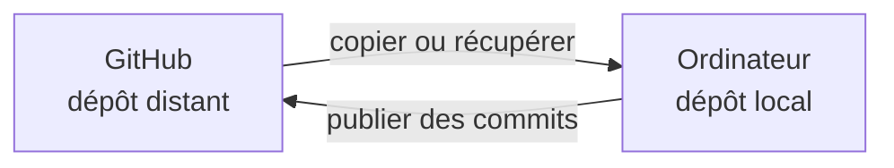

## Étape 1 : cloner le dépôt et créer ta branche locale

Tu as déjà manipulé des branches et des commits depuis GitHub.com. Maintenant, on passe sur ton ordinateur.

### Dépôt distant et dépôt local

Le dépôt que tu vois sur GitHub est le **dépôt distant**. Avec Git, tu travailles normalement sur une copie complète stockée sur ta machine : le **dépôt local**.

Le dépôt local possède ses propres fichiers, branches et commits. Il n'est pas synchronisé en permanence avec GitHub : certaines commandes servent à récupérer des changements, d'autres à publier les tiens.



### 1. Cloner ta copie du tutoriel

Ouvre un **terminal**, c'est-à-dire une interface texte dans laquelle tu peux saisir des commandes, dans le dossier où tu ranges tes projets. Puis exécute :

```bash
git clone https://github.com/{{ full_repo_name }}.git
cd {{ repo_name }}
```

`git clone` télécharge les fichiers **et l'historique Git**.

`cd` signifie **change directory** : cette commande demande au terminal de se placer dans le dossier du dépôt que tu viens de cloner. Git configure aussi automatiquement un **remote**, c'est-à-dire une destination distante associée au dépôt local.

Par convention, le remote principal s'appelle généralement `origin`.

Vérifie-le :

```bash
git remote -v
```

L'option `-v` signifie **verbose** : elle demande à Git d'afficher davantage de détails, ici les URL utilisées pour récupérer et publier les changements.

Tu dois voir des URL qui pointent vers :

```text
{{ full_repo_name }}
```

### 2. Ouvrir le projet dans VS Code

Si la commande `code` est disponible :

```bash
code .
```

Dans cette commande, `.` représente le **dossier courant**. `code .` signifie donc « ouvrir le dossier dans lequel je me trouve avec VS Code ».

Sinon, ouvre Visual Studio Code puis **File → Open Folder...** et sélectionne le dossier `{{ repo_name }}`.

Ouvre ensuite le terminal intégré de VS Code avec **Terminal → New Terminal**. À partir de maintenant, tu peux réaliser toutes les commandes du tutoriel directement dans ce terminal.

### 3. Vérifier ton identité Git

Chaque commit contient un auteur. Ici, l'option `--global` demande à Git de lire ou modifier la configuration de **ton utilisateur sur cet ordinateur**, et pas uniquement celle de ce dépôt.

Vérifie la configuration actuelle :

```bash
git config --global user.name
git config --global user.email
```

Si l'une des valeurs est vide ou incorrecte, configure-la :

```bash
git config --global user.name "Prénom Nom"
git config --global user.email "ton-adresse@example.com"
```

> [!TIP]
> L'adresse utilisée dans un commit peut apparaître dans l'historique du dépôt. GitHub permet d'utiliser une adresse `noreply` depuis les paramètres **Emails** de ton compte.

### 4. Prendre le réflexe `git status`

Exécute :

```bash
git status
```

`git status` répond à trois questions essentielles :

- sur quelle branche suis-je ?
- quels fichiers ai-je modifiés ?
- quelles modifications sont préparées pour le prochain commit ?

Quand tu es perdu avec Git, commence par `git status`.

Vérifie aussi ta branche actuelle :

```bash
git branch --show-current
```

L'option `--show-current` demande simplement à Git d'afficher le nom de la branche sur laquelle tu te trouves.

Tu dois être sur `main`.

### 5. Créer une branche de travail

Dans le club, on évite de travailler directement sur `main`. Crée une branche dédiée :

```bash
git switch -c feature/robot-status
```

Le préfixe `feature/` est ici une **convention de nommage** : il permet de reconnaître rapidement qu'il s'agit d'une branche créée pour développer une fonctionnalité. Git lui-même n'impose pas ce préfixe.

`git switch` change de branche et l'option `-c` signifie ici **create** : elle crée d'abord la nouvelle branche puis te place dessus.

Puis vérifie :

```bash
git status
```

Enfin, publie la branche sur GitHub :

```bash
git push -u origin feature/robot-status
```

Décomposition :

- `git push` **publie sur GitHub les commits de ta branche locale** ;
- `origin` est le nom du remote GitHub créé automatiquement par `git clone` ;
- `feature/robot-status` est le nom de ta branche ;
- `-u` signifie ici : « associe ma branche locale à cette branche sur GitHub ».

Cette branche distante associée devient la **branche amont**, appelée **upstream branch** dans Git. Une fois cette relation enregistrée, Git sait par défaut où envoyer tes prochains `git push` et depuis quelle branche distante récupérer avec `git pull`.

Tu peux visualiser cette relation avec :

```bash
git branch -vv
```

Ici, `-vv` demande un affichage détaillé des branches locales, notamment leur dernier commit et leur branche amont lorsqu'elle existe.

Si tout est correct, la ligne de `feature/robot-status` contient une indication comme `[origin/feature/robot-status]`.

> [!IMPORTANT]
> Utilise exactement le nom `feature/robot-status` pour cette branche : l'automatisation du tutoriel l'attend.

Dès que la branche apparaît sur GitHub, Mona détecte ton premier `push` et publie l'étape suivante.

<details>
<summary>Le push demande une authentification ou échoue ?</summary>

Le clone d'un dépôt public ne nécessite pas forcément d'authentification, mais **push** modifie GitHub et doit donc t'identifier.

Utilise la méthode déjà configurée sur ton ordinateur, typiquement **HTTPS** ou **SSH**, deux méthodes permettant à Git de s'authentifier auprès de GitHub. Tu peux aussi utiliser **GitHub CLI (`gh`)**, l'outil officiel en ligne de commande de GitHub. Si aucune méthode n'est configurée, suis la documentation GitHub sur l'authentification Git avant de continuer.

</details>
