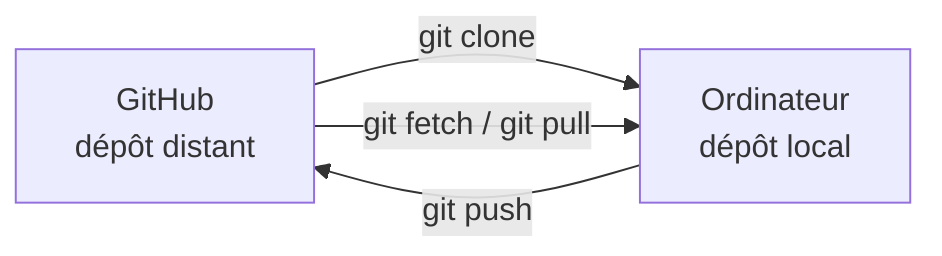

## Étape 1 : cloner le dépôt et créer ta branche locale

Tu as déjà manipulé des branches et des commits depuis GitHub.com. Maintenant, on passe sur ton ordinateur.

### Dépôt distant et dépôt local

Le dépôt que tu vois sur GitHub est le **dépôt distant**. Avec Git, tu travailles normalement sur une copie complète stockée sur ta machine : le **dépôt local**.



### 1. Cloner ta copie du tutoriel

Ouvre un terminal dans le dossier où tu ranges tes projets, puis exécute :

```bash
git clone https://github.com/{{ full_repo_name }}.git
cd {{ repo_name }}
```

`git clone` télécharge les fichiers **et l'historique Git**. Git configure aussi automatiquement un **remote**, c'est-à-dire une destination distante associée au dépôt local.

Par convention, le remote principal s'appelle généralement `origin`.

Vérifie-le :

```bash
git remote -v
```

Tu dois voir des URL qui pointent vers :

```text
{{ full_repo_name }}
```

### 2. Ouvrir le projet dans VS Code

Si la commande `code` est disponible :

```bash
code .
```

Sinon, ouvre Visual Studio Code puis **File → Open Folder...** et sélectionne le dossier `{{ repo_name }}`.

Ouvre ensuite le terminal intégré de VS Code avec **Terminal → New Terminal**. À partir de maintenant, tu peux réaliser toutes les commandes du tutoriel directement dans ce terminal.

### 3. Vérifier ton identité Git

Chaque commit contient un auteur. Vérifie la configuration actuelle :

```bash
git config --global user.name
git config --global user.email
```

Si l'une des valeurs est vide ou incorrecte, configure-la :

```bash
git config --global user.name "Prénom Nom"
git config --global user.email "ton-adresse@example.com"
```

> [!TIP]
> L'adresse utilisée dans un commit peut apparaître dans l'historique du dépôt. GitHub permet d'utiliser une adresse `noreply` depuis les paramètres **Emails** de ton compte.

### 4. Prendre le réflexe `git status`

Exécute :

```bash
git status
```

`git status` répond à trois questions essentielles :

- sur quelle branche suis-je ?
- quels fichiers ai-je modifiés ?
- quelles modifications sont préparées pour le prochain commit ?

Quand tu es perdu avec Git, commence par `git status`.

Vérifie aussi ta branche actuelle :

```bash
git branch --show-current
```

Tu dois être sur `main`.

### 5. Créer une branche de travail

Dans le club, on évite de travailler directement sur `main`. Crée une branche dédiée :

```bash
git switch -c feature/robot-status
```

Puis vérifie :

```bash
git status
```

Enfin, publie la branche sur GitHub :

```bash
git push -u origin feature/robot-status
```

Décomposition :

- `git push` envoie tes commits vers un remote ;
- `origin` est le remote GitHub ;
- `feature/robot-status` est ta branche ;
- `-u` enregistre la branche distante comme **upstream** de ta branche locale. Les prochains `git push` et `git pull` pourront donc fonctionner sans répéter le nom du remote et de la branche.

> [!IMPORTANT]
> Utilise exactement le nom `feature/robot-status` pour cette branche : l'automatisation du tutoriel l'attend.

Dès que la branche apparaît sur GitHub, Mona détecte ton premier `push` et publie l'étape suivante.

<details>
<summary>Le push demande une authentification ou échoue ?</summary>

Le clone d'un dépôt public ne nécessite pas forcément d'authentification, mais **push** modifie GitHub et doit donc t'identifier.

Utilise la méthode déjà configurée sur ton ordinateur, typiquement HTTPS avec le gestionnaire d'identifiants Git, GitHub CLI ou SSH. Si aucune méthode n'est configurée, suis la documentation GitHub sur l'authentification Git avant de continuer.

</details>
