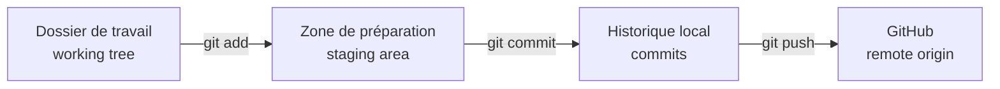

## Étape 2 : comprendre le dossier de travail, la préparation et le commit

Ta branche existe maintenant à la fois sur ton ordinateur et sur GitHub.

On va faire une vraie modification et suivre son trajet jusqu'à l'historique Git.

### Les trois zones à comprendre

Git distingue plusieurs états pour tes modifications :



- le **dossier de travail** (_working tree_) correspond aux fichiers tels qu'ils existent actuellement dans ton dossier ;
- la **zone de préparation** (_staging area_) contient uniquement les changements sélectionnés pour le prochain commit ;
- un **commit** enregistre le contenu préparé dans l'historique local ;
- `git push` publie ensuite ces commits locaux sur GitHub.

Le verbe anglais **to stage** signifie donc « ajouter un changement à la zone de préparation ».

### 1. Modifier le fichier dans VS Code

Ouvre :

```text
robot/config.yaml
```

Remplace :

```yaml
max_speed: 0.4
```

par :

```yaml
max_speed: 0.8
```

Enregistre le fichier.

Dans VS Code, ouvre le panneau **Source Control** : c'est l'interface graphique intégrée qui permet de voir et manipuler l'état Git du projet. Tu dois maintenant voir `robot/config.yaml` dans **Changes**, c'est-à-dire les changements non encore préparés.

### 2. Inspecter avant de préparer le commit

Un **diff** est une vue ligne par ligne de ce qui a changé entre deux états.

Dans le terminal :

```bash
git status
git diff
```

Ici, `git diff` montre les changements du dossier de travail qui ne sont pas encore dans la zone de préparation.

N'ajoute pas tout aveuglément avec `git add .` : le point `.` désigne ici tout le dossier courant. Pour cet exercice, sélectionne précisément le fichier voulu :

```bash
git add robot/config.yaml
```

Puis :

```bash
git status
git diff --staged
```

`git diff --staged` montre **exactement ce qui est dans la zone de préparation et entrera dans le prochain commit**.

Dans VS Code, le fichier est maintenant passé de **Changes** à **Staged Changes**, c'est-à-dire « changements préparés ». Le terminal et l'interface graphique représentent donc le même état Git.

### 3. Savoir revenir en arrière

Avant de committer, essaie volontairement de retirer le fichier de la staging area :

```bash
git restore --staged robot/config.yaml
```

Vérifie avec :

```bash
git status
```

Puis ajoute-le de nouveau à la zone de préparation :

```bash
git add robot/config.yaml
```

Cette commande n'annule pas ta modification : elle retire simplement le fichier du prochain commit.

### 4. Créer le commit

Crée maintenant un commit local. L'option `-m` permet d'écrire directement le **message du commit**. Le message suivant est un exemple, pas un mot de passe :

```bash
git commit -m "Augmenter la vitesse maximale du robot"
```

Vérifie immédiatement :

```bash
git status
git log -1 --oneline
```

`git log` affiche l'historique des commits ; `-1` limite l'affichage au dernier commit et `--oneline` l'affiche sous une forme compacte sur une seule ligne.

À ce stade, ton commit existe **sur ton ordinateur**, mais pas encore sur GitHub.

C'est une distinction fondamentale :

```text
git commit ≠ git push
```

Publie-le :

```bash
git push
```

Le bot vérifiera que `robot/config.yaml` contient bien la nouvelle valeur et que ta branche contient un commit propre à ton travail.
