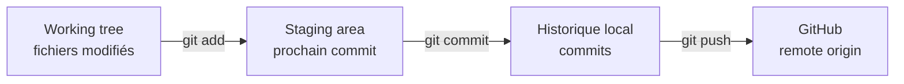

## Étape 2 : comprendre working tree, staging et commit

Ta branche existe maintenant à la fois sur ton ordinateur et sur GitHub.

On va faire une vraie modification et suivre son trajet jusqu'à l'historique Git.

### Les trois zones à comprendre



- le **working tree** correspond aux fichiers présents dans ton dossier de travail ;
- la **staging area** est la sélection exacte des changements qui entreront dans le prochain commit ;
- un **commit** enregistre cette sélection dans l'historique local ;
- `git push` publie ensuite les commits sur GitHub.

### 1. Modifier le fichier dans VS Code

Ouvre :

```text
robot/config.yaml
```

Remplace :

```yaml
max_speed: 0.4
```

par :

```yaml
max_speed: 0.8
```

Enregistre le fichier.

Dans l'onglet **Source Control** de VS Code, tu dois maintenant voir `robot/config.yaml` dans **Changes**.

### 2. Inspecter avant de préparer le commit

Dans le terminal :

```bash
git status
git diff
```

`git diff` montre les différences entre ton working tree et la staging area.

Ne stage pas tout aveuglément avec `git add .` pour cet exercice. Sélectionne précisément le fichier voulu :

```bash
git add robot/config.yaml
```

Puis :

```bash
git status
git diff --staged
```

`git diff --staged` montre **exactement ce qui entrera dans le prochain commit**.

Dans VS Code, le fichier est maintenant passé de **Changes** à **Staged Changes**. La CLI et l'interface graphique représentent donc le même état Git.

### 3. Savoir revenir en arrière

Avant de committer, essaie volontairement de retirer le fichier de la staging area :

```bash
git restore --staged robot/config.yaml
```

Vérifie avec :

```bash
git status
```

Puis stage-le de nouveau :

```bash
git add robot/config.yaml
```

Cette commande n'annule pas ta modification : elle retire simplement le fichier du prochain commit.

### 4. Créer le commit

Crée maintenant un commit local. Le message suivant est un exemple, pas un mot de passe :

```bash
git commit -m "Increase robot max speed"
```

Vérifie immédiatement :

```bash
git status
git log -1 --oneline
```

À ce stade, ton commit existe **sur ton ordinateur**, mais pas encore sur GitHub.

C'est une distinction fondamentale :

```text
git commit ≠ git push
```

Publie-le :

```bash
git push
```

Le bot vérifiera que `robot/config.yaml` contient bien la nouvelle valeur et que ta branche contient un commit propre à ton travail.
